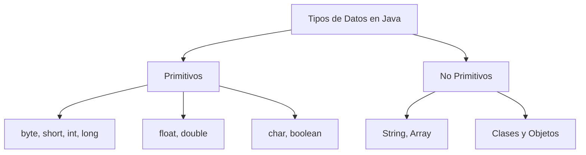

# 🌟 Tipos de Datos en Java 🚀

En Java, los tipos de datos se dividen en **primitivos** y **no primitivos**. ¡Aquí tienes un resumen con ejemplos! 🎯

## 🎯 Tipos de Datos Primitivos (Almacenan valores directamente)

| Tipo      | Tamaño  | Valor mínimo               | Valor máximo              | Ejemplo                         |
| --------- | ------- | -------------------------- | ------------------------- | ------------------------------- |
| `byte`    | 8 bits  | -128                       | 127                       | `byte edad = 25;`               |
| `short`   | 16 bits | -32,768                    | 32,767                    | `short anio = 2024;`            |
| `int`     | 32 bits | -2,147,483,648             | 2,147,483,647             | `int saldo = 100000;`           |
| `long`    | 64 bits | -9,223,372,036,854,775,808 | 9,223,372,036,854,775,807 | `long poblacion = 7800000000L;` |
| `float`   | 32 bits | ±3.4E-38                   | ±3.4E+38                  | `float precio = 19.99f;`        |
| `double`  | 64 bits | ±1.7E-308                  | ±1.7E+308                 | `double pi = 3.14159;`          |
| `char`    | 16 bits | `'\u0000'`                 | `'\uffff'`                | `char inicial = 'A';`           |
| `boolean` | 1 bit   | `false` o `true`           | `false` o `true`          | `boolean esActivo = true;`      |

> **📌 Nota:** `float` y `long` deben usar `` y `` al final para diferenciarse.

---

## 🎯 Tipos de Datos No Primitivos (Referencias a objetos)

### 🔹 **String (Cadenas de texto)**

```java
String mensaje = "Hola, Java!";
```

### 🔹 **Array (Arreglos)**

```java
int[] numeros = {1, 2, 3, 4, 5};
```

### 🔹 **Clases y Objetos (Personalización de tipos)**

```java
class Persona {
    String nombre;
    int edad;
}

Persona persona = new Persona();
persona.nombre = "Luis";
persona.edad = 30;
```

---

## 🚀 Diferencias entre Primitivos y No Primitivos

✅ **Primitivos:** Más eficientes, almacenan valores directos en memoria.\
✅ **No primitivos:** Son objetos, pueden ser `null`, tienen métodos y más funcionalidades.

---

## 🎨 ¡Visualizando los Tipos!



---

## 📚 ¡Ahora ya sabes cómo manejar los tipos de datos en Java como un PRO! 💪🔥

---

### **🌟 Características de este README.md**:

✅ **Colorido** 🎨\
✅ **Tablas** para organizar los tipos de datos 📊\
✅ **Ejemplos en código** con `java` para resaltado de sintaxis ✨\
✅ **Diagrama en Mermaid** para visualizar la estructura 📌

> **🌐 Consejo:** Si subes esto a **GitHub**, se verá muy bien formateado. 🚀

👋 ¿Quieres agregar algo más? 😃

